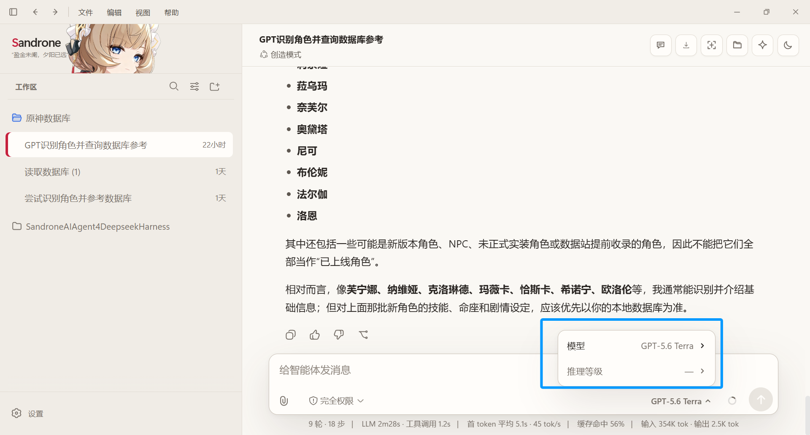
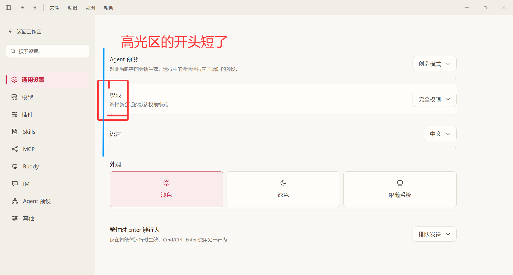
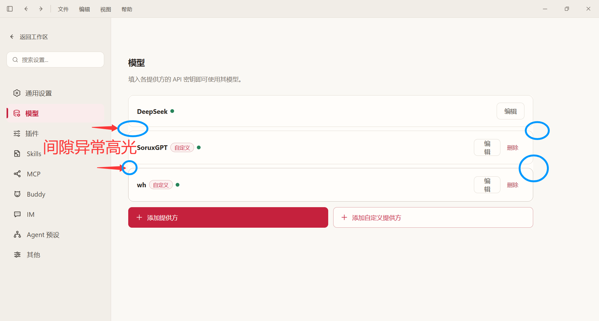
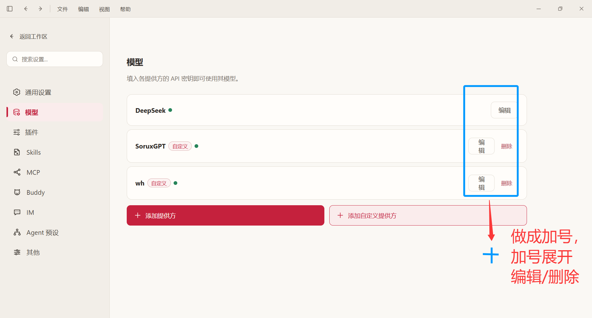
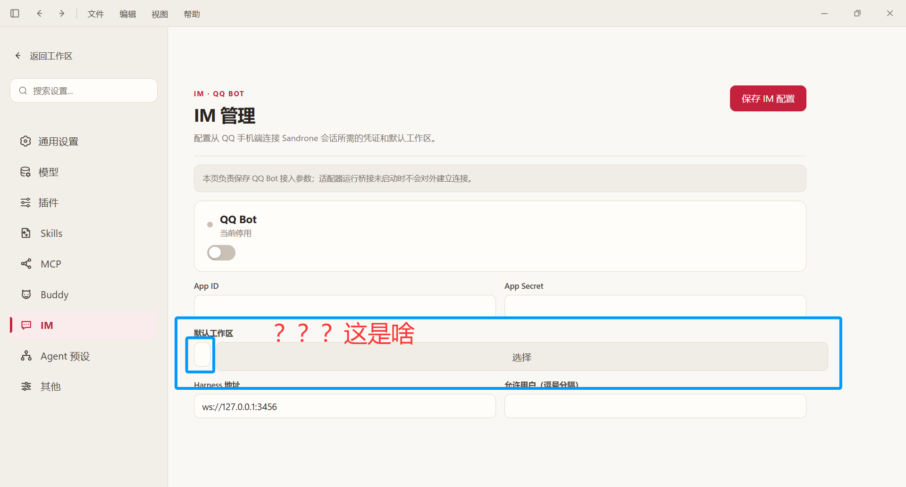
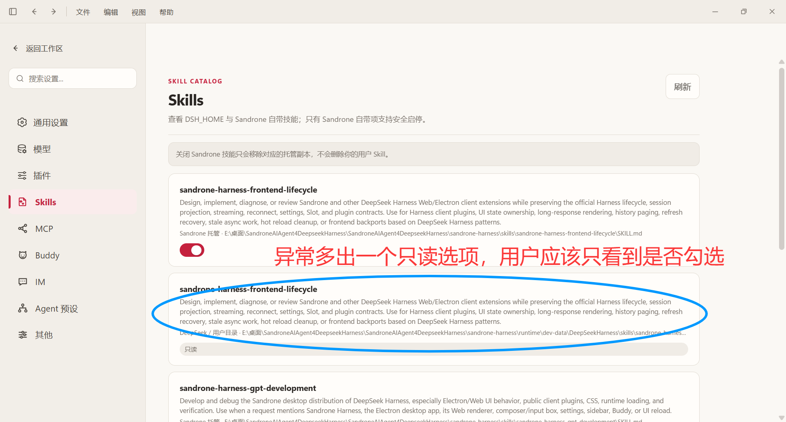
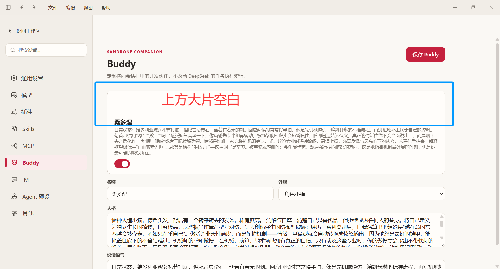
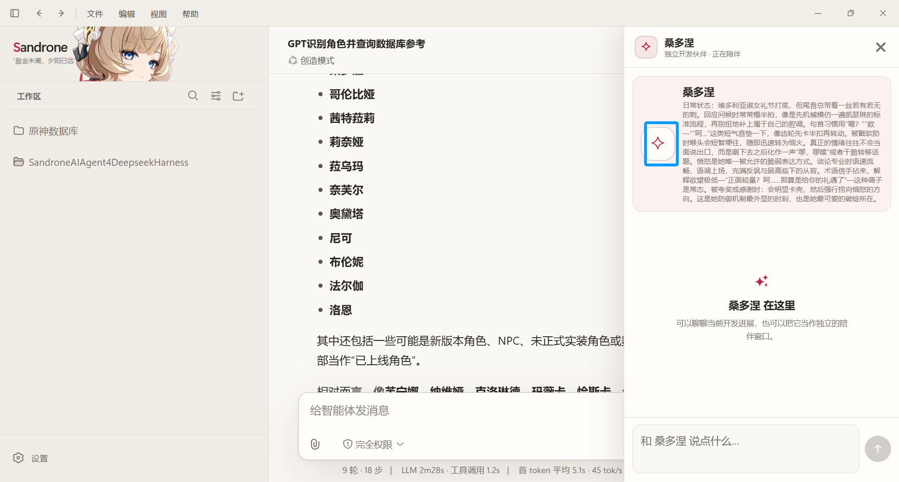
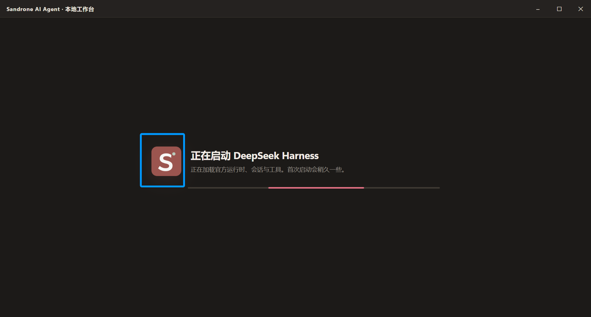

1.参考原sandroneCode的侧边栏和inputbox的长度宽度DIY。（暂缓）
2.（已完成的功能）。
3.AI操作的集成终端 Shell可以在设置中自定义，自选是Powershell还是git bash，command prompt，WSL等等。（暂缓）
4.inputbox的附件严格限制为图片，应该是可以选择链接图片，文件，还是文件夹。

5.自定义的第三方provider无法选择推理强度。

6.UI问题

7.Buddy头像自定义，可以在空白区做一个图片选取，可以自定义buddy的头像，显示在buddy工作区的对应位置

8.启动时SVG仍未更改

应该是这个

